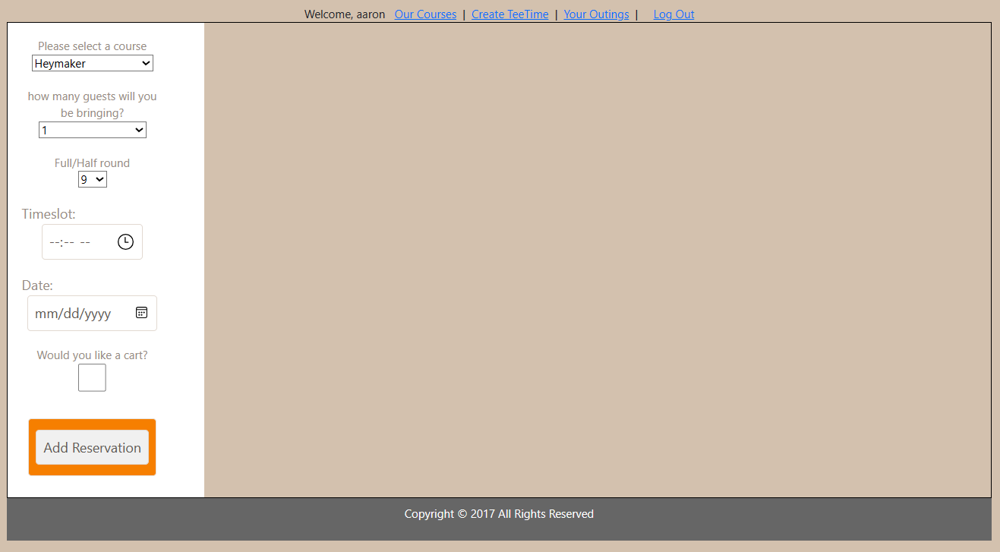
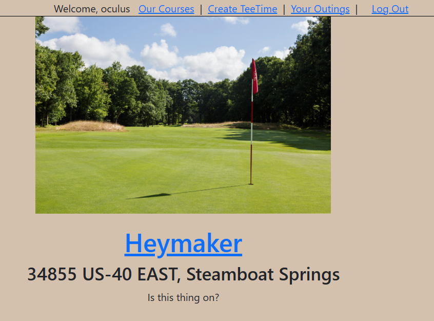

# PROJECT 4: TEE TIME

My father is a huge golf fan, and I've seen him use a tee time scheduler before. It seemed like a good fit.

# Screenshots

# Getting Started with Create React App

This project was bootstrapped with [Create React App](https://github.com/facebook/create-react-app).

# Technologies Used

- JavaScript
- HTML
- CSS
- MongoDB
- Heroku hosting
- React JS

# Getting Started

[Click to View Project Planning]([User Stories, Wireframes, and ERDs](https://trello.com/b/dxwPn2D5/tee-time-scheduler))
[Click to Visit the Site!]([Heroku Site](https://teetime-usa-6d9c475c5cdf.herokuapp.com/))

# Next Steps

- Implement course Ratings
- write ABOUT ME page
- implement prices
- implement timeSlots